<!-- README.md is generated from README.Rmd. Please edit that file -->

# Análise Terra Preta - Silva Ribeiro

## Carregando Pacotes

``` r
library(BiocManager)
library(tidyverse)
library(cluster)
library(ggrepel)
library(writexl)
library(readxl)
library(vegan)
library(dplyr)
library(tidyr)
library(pls)
# library(mixOmics)
```

## Importar o BD do excel

``` r
df <- read_xlsx("data-raw/dados_terrapreta.xlsx") |> 
  rename(if_var = IF) |> 
  janitor::clean_names()
```

## Salvando na Versão de R

``` r
write_rds(df,"data/terra-preta.rds")
```

## Carregando o Banco de Dados do R

``` r
data_set <- read_rds("data/terra-preta.rds")
glimpse(data_set)
#> Rows: 40
#> Columns: 19
#> $ tratamentos <chr> "MTA", "MTA", "MTA", "MTA", "MTA", "MTA", "MTA", "MTA", "M…
#> $ ds          <dbl> 1.179139, 1.209172, 1.223709, 1.279122, 1.222785, 1.211284…
#> $ pt          <dbl> 0.4850923, 0.4719773, 0.4656292, 0.4414315, 0.4660326, 0.4…
#> $ mic         <dbl> 0.2553810, 0.2348952, 0.2427746, 0.2404692, 0.2433800, 0.2…
#> $ mac         <dbl> 0.22971136, 0.23708213, 0.22285460, 0.20096234, 0.22265261…
#> $ ksat        <dbl> 13.170000, 18.560000, 10.970000, 10.000000, 13.175000, 11.…
#> $ if_var      <dbl> 62.85714, 79.36508, 47.94521, 74.64789, 66.20383, 61.61321…
#> $ dmp         <dbl> 3.117068, 3.935556, 2.773950, 2.961878, 3.197113, 2.437374…
#> $ iee         <dbl> 8.564444, 9.031176, 8.579939, 8.512417, 8.671994, 8.704527…
#> $ n           <dbl> 0.1590000, 0.1710000, 0.1610000, 0.1580000, 0.1622500, 0.1…
#> $ s           <dbl> 0.05960000, 0.07550000, 0.06170000, 0.06380000, 0.06515000…
#> $ p_h         <dbl> 4.800000, 5.100000, 5.100000, 5.100000, 5.025000, 5.220398…
#> $ ctc         <dbl> 159.3300, 145.9300, 169.2400, 156.8400, 157.8350, 158.7280…
#> $ v_percent   <dbl> 0.6171468, 0.6573700, 0.6927440, 0.6812038, 0.6621161, 0.7…
#> $ mos         <dbl> 60.00000, 57.00000, 56.00000, 62.00000, 58.75000, 60.35167…
#> $ p           <dbl> 203.00000, 184.00000, 209.00000, 163.00000, 189.75000, 187…
#> $ k           <dbl> 0.8000000, 0.7000000, 0.8000000, 0.7000000, 0.7500000, 0.6…
#> $ ca          <dbl> 87.00000, 86.00000, 105.00000, 96.00000, 93.50000, 103.023…
#> $ mg          <dbl> 10.530000, 9.230000, 11.440000, 10.140000, 10.335000, 10.6…
```

## Estatística Descritiva

### Hitograma

``` r
nome_vars <- data_set |> select(-tratamentos) |> names()
walk(nome_vars,~{
  plot_hist <- data_set |> 
  ggplot(aes(x=!!sym(.x), y= ..density..)) + 
  geom_histogram(color="black", fill="aquamarine4",
                 bins = 12) +
  theme_minimal()
  print(plot_hist)
})
```

<!-- --><!-- --><!-- --><!-- --><!-- --><!-- --><!-- --><!-- --><!-- --><!-- --><!-- --><!-- --><!-- --><!-- --><!-- --><!-- --><!-- --><!-- -->

### Boxplot

``` r
walk(nome_vars,~{
  plot_box <- data_set |> 
    ggplot(aes(x=tratamentos, y= !!sym(.x),fill=tratamentos)) + 
    geom_boxplot() +
    theme_minimal() +
    theme(legend.position = "none") +
    labs(x="Tratamentos")
  print(plot_box)
})
```

<!-- --><!-- --><!-- --><!-- --><!-- --><!-- --><!-- --><!-- --><!-- --><!-- --><!-- --><!-- --><!-- --><!-- --><!-- --><!-- --><!-- --><!-- -->

### Tabela da Estatistica Descriva

``` r
estat_names <- c("Min","Q1","Med","Media","Q3",
                 "Max","DP","CV","Skn","Krt")
estat_desc <- function(x){
  x<-na.omit(x)
  m <- mean(x,na.rm = TRUE)
  md <- median(x)
  mini <- min(x,na.rm = TRUE)
  q1 <- quantile(x,.25)
  q3 <- quantile(x,.75)
  maxi <- max(x,na.rm = TRUE)
  dp <- sd(x,na.rm = TRUE)
  cv <- 100*dp/m
  ass <- agricolae::skewness(x)
  curt <- agricolae::kurtosis(x)
  c(mini,q1,md,m,q3,maxi,dp,cv,ass,curt)
}

data_set |> 
  group_by(tratamentos) |> 
  reframe( across(
    .cols = ds:mg,
    .fns = estat_desc,
    .names = "{.col}"
  )) |>
  ungroup() |> 
  add_column(estat = rep(estat_names,4)) |> 
  relocate(estat) |> 
  writexl::write_xlsx("output/estatistica-descritiva.xlsx")
```

### Matrix de Correlação com o Corrplot - Por tratamentos

``` r
data_set |> 
  filter(tratamentos == "LAR") |> 
  select(ds:mg) |> 
  cor(use = "complete.obs") |> 
  corrplot::corrplot( method = "color",
         outline = T,,
         addgrid.col = "darkgray",cl.pos = "r", tl.col = "black",
         tl.cex = 1, cl.cex = 1, type = "upper", bg="azure2",
         diag = FALSE,
         # addCoef.col = "black",
         cl.ratio = 0.2,
         cl.length = 5,
         number.cex = 0.8)
```

<!-- -->

``` r
data_set |> 
  filter(tratamentos == "MAM") |> 
  select(ds:mg) |> 
  cor(use = "complete.obs") |> 
  corrplot::corrplot( method = "color",
         outline = T,,
         addgrid.col = "darkgray",cl.pos = "r", tl.col = "black",
         tl.cex = 1, cl.cex = 1, type = "upper", bg="azure2",
         diag = FALSE,
         # addCoef.col = "black",
         cl.ratio = 0.2,
         cl.length = 5,
         number.cex = 0.8)
```

<!-- -->

``` r
data_set |> 
  filter(tratamentos == "MTA") |> 
  select(ds:mg) |> 
  cor(use = "complete.obs") |> 
  corrplot::corrplot( method = "color",
         outline = T,,
         addgrid.col = "darkgray",cl.pos = "r", tl.col = "black",
         tl.cex = 1, cl.cex = 1, type = "upper", bg="azure2",
         diag = FALSE,
         # addCoef.col = "black",
         cl.ratio = 0.2,
         cl.length = 5,
         number.cex = 0.8)
```

<!-- -->

``` r
data_set |> 
  filter(tratamentos == "QAF") |> 
  select(ds:mg) |> 
  cor(use = "complete.obs") |> 
  corrplot::corrplot( method = "color",
         outline = T,,
         addgrid.col = "darkgray",cl.pos = "r", tl.col = "black",
         tl.cex = 1, cl.cex = 1, type = "upper", bg="azure2",
         diag = FALSE,
         # addCoef.col = "black",
         cl.ratio = 0.2,
         cl.length = 5,
         number.cex = 0.8)
```

<!-- -->

## Análise Multivariada

### Análise de Cluster

\#Distância Euclidiana + cluster hierárquico

``` r

tmp <- data_set %>% 
  select(tratamentos, ds:mg) %>%    tidyr::drop_na()

x <- tmp %>%
  select(ds:mg)

grupo <- tmp %>%
  pull(tratamentos) %>%
  factor()

xsc <- scale(x)

# COMPARAÇÃO DE DISTÂNCIA HIERARQUICA
dist_euc  <- dist(xsc, method = "euclidean")
dist_man  <- dist(xsc, method = "manhattan")
dist_mink <- dist(xsc, method = "minkowski", p = 3)

hc_euc  <- hclust(dist_euc,  method = "ward.D2")
hc_man  <- hclust(dist_man,  method = "ward.D2")
hc_mink <- hclust(dist_mink, method = "ward.D2")

#DENDROGRAMAS COMPARATIVOS
par(mfrow = c(1, 3))
plot(hc_euc, labels = grupo, main = "Ward + Euclidiana", cex = 0.6)
plot(hc_man, labels = grupo, main = "Ward + Manhattan",  cex = 0.6)
plot(hc_mink, labels = grupo, main = "Ward + Minkowski (p=3)", cex = 0.6)
```

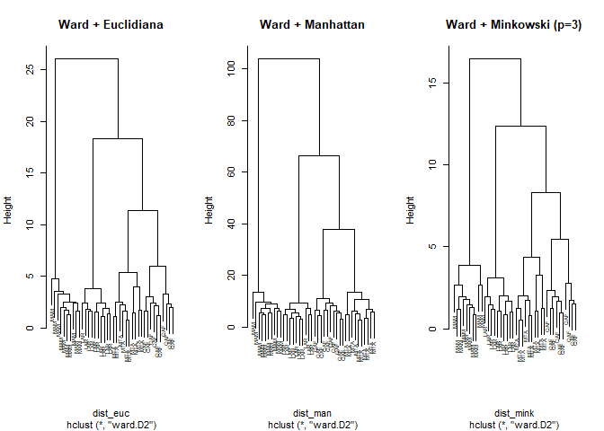<!-- -->

``` r
par(mfrow = c(1, 1))

# DEDROGRAMA DISTÂNCIA EUCLIDEANA + CORTE K
distancia <- dist(xsc, method = "euclidean")

cluster <- hclust(distancia, method = "ward.D2")

plot(cluster,
     labels = grupo,
     main = "Dendrograma (Ward.D2) - dados padronizados",
     xlab = "", 
     sub = "",
     cex = 0.6)

k <- 4
rect.hclust(cluster, k = k, border = 2:5)
```

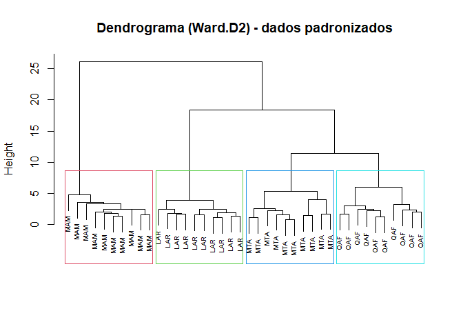<!-- -->

``` r

cl <- cutree(cluster, k = k)

table(Cluster = cl, Tratamento = grupo)
#>        Tratamento
#> Cluster LAR MAM MTA QAF
#>       1   0   0  10   0
#>       2   0   0   0  10
#>       3  10   0   0   0
#>       4   0  10   0   0


#VALIDAÇÃO
sil <- silhouette(cl, distancia)
plot(sil, main = "Silhouette - Cluster Hierárquico (Ward)")
```

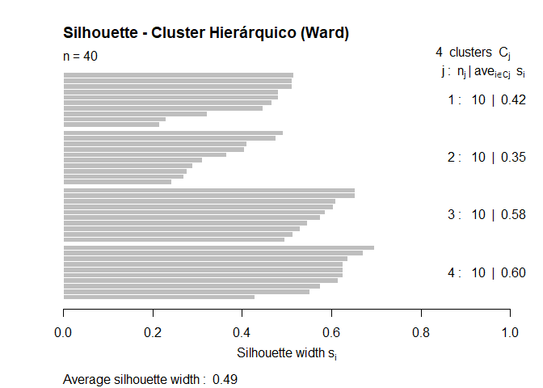<!-- -->

``` r
summary(sil)
#> Silhouette of 40 units in 4 clusters from silhouette.default(x = cl, dist = distancia) :
#>  Cluster sizes and average silhouette widths:
#>        10        10        10        10 
#> 0.4176493 0.3533439 0.5761618 0.6043355 
#> Individual silhouette widths:
#>    Min. 1st Qu.  Median    Mean 3rd Qu.    Max. 
#>  0.2156  0.4089  0.5116  0.4879  0.6051  0.6959

set.seed(123)

wcss <- sapply(1:10, function(k){
  km <- kmeans(xsc, centers = k, nstart = 25)
  km$tot.withinss
})

plot(1:10, wcss, type = "b",
     xlab = "Número de clusters (k)",
     ylab = "WCSS (Within-Cluster Sum of Squares)",
     main = "Elbow Method (k-means) - apoio para escolha de k")
```

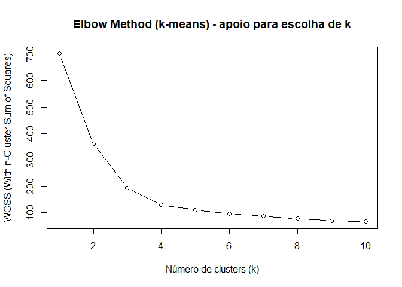<!-- --> \### Análise
de Componentes Principais (PCA)

``` r

pca <- prcomp(xsc, center = TRUE, scale. = FALSE)
summary(pca) 
#> Importance of components:
#>                           PC1    PC2     PC3     PC4     PC5     PC6     PC7
#> Standard deviation     3.0192 2.2394 1.09597 0.96644 0.71060 0.54342 0.47558
#> Proportion of Variance 0.5064 0.2786 0.06673 0.05189 0.02805 0.01641 0.01257
#> Cumulative Proportion  0.5064 0.7850 0.85177 0.90365 0.93171 0.94811 0.96068
#>                            PC8     PC9    PC10    PC11    PC12    PC13    PC14
#> Standard deviation     0.43034 0.39386 0.33837 0.29505 0.26135 0.18645 0.17377
#> Proportion of Variance 0.01029 0.00862 0.00636 0.00484 0.00379 0.00193 0.00168
#> Cumulative Proportion  0.97097 0.97959 0.98595 0.99078 0.99458 0.99651 0.99819
#>                           PC15    PC16    PC17    PC18
#> Standard deviation     0.13113 0.08669 0.06595 0.05992
#> Proportion of Variance 0.00096 0.00042 0.00024 0.00020
#> Cumulative Proportion  0.99914 0.99956 0.99980 1.00000

var_exp <- (pca$sdev^2) / sum(pca$sdev^2)

plot(var_exp, type = "b",
     xlab = "Componente Principal",
     ylab = "Proporção da Variância Explicada",
     main = "Scree Plot (PCA)")
```

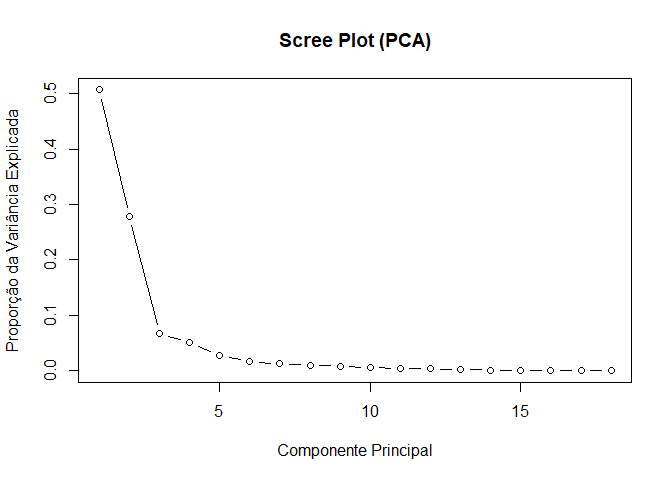<!-- -->

``` r

scores <- as.data.frame(pca$x) %>%
  mutate(tratamentos = grupo)

loadings <- as.data.frame(pca$rotation) %>%
  rownames_to_column("variavel")

top_pc1 <- loadings %>%
  mutate(abs_val = abs(PC1)) %>%
  arrange(desc(abs_val)) %>%
  slice(1:10)

top_pc2 <- loadings %>%
  mutate(abs_val = abs(PC2)) %>%
  arrange(desc(abs_val)) %>%
  slice(1:10)

top_pc1
#>     variavel        PC1         PC2          PC3        PC4          PC5
#> 1          p -0.3245050 -0.02575348 -0.059930134 0.02139720  0.021167655
#> 2         ca -0.3238657 -0.04209863  0.006178792 0.02206061 -0.027148172
#> 3  v_percent -0.3229135 -0.01304030  0.005142969 0.01657994 -0.074876075
#> 4        ctc -0.3224758 -0.06421314 -0.002386852 0.01255769 -0.003941003
#> 5          k -0.3076060  0.09295262  0.216155099 0.10955391 -0.122651445
#> 6          s  0.3021814 -0.02961952  0.024253033 0.15278279 -0.079567465
#> 7         mg -0.2979626  0.12306382  0.188703243 0.10617164 -0.198338236
#> 8        p_h -0.2976923  0.11579637  0.072615758 0.05028509 -0.042052234
#> 9     if_var  0.2381003 -0.20495391  0.251219809 0.21606912  0.021040299
#> 10         n -0.2300771 -0.30878260  0.067545638 0.07184058  0.035176308
#>             PC6          PC7         PC8          PC9         PC10        PC11
#> 1   0.029236561  0.176617914 -0.05054767  0.007832226 -0.176606244  0.17760429
#> 2  -0.127918845  0.158437073  0.14557658  0.198894548 -0.093137871  0.23797726
#> 3  -0.145879383  0.005048417 -0.21519249 -0.144383922 -0.132074410  0.07310601
#> 4  -0.064096308  0.227443729  0.20296067  0.147997338  0.005562998  0.05817430
#> 5  -0.101759022  0.063745187  0.16351811  0.102044951  0.110191301 -0.08854308
#> 6  -0.485143195  0.002457714  0.40570646 -0.093304960  0.170856158  0.59118282
#> 7  -0.167718892 -0.066799445  0.05595574  0.067971079  0.155292023 -0.40646108
#> 8   0.104619960 -0.180168492 -0.54605316 -0.122198939  0.411404777  0.46787572
#> 9  -0.515460943  0.172570760 -0.45989650  0.311925028  0.213005538 -0.20630550
#> 10 -0.007751944  0.163377842 -0.02497109  0.116889474 -0.285848600  0.16661265
#>            PC12        PC13         PC14         PC15         PC16
#> 1  -0.335657419 -0.25364999 -0.057441228  0.621175434 -0.157023978
#> 2  -0.170269212 -0.04935085 -0.128927856 -0.428016669  0.118815258
#> 3  -0.274031339  0.27722174  0.747432427 -0.013109641  0.009368660
#> 4  -0.005773156 -0.14673465  0.031822832 -0.490303927  0.003360117
#> 5   0.063701515  0.08437166 -0.209297353  0.075622395 -0.727374649
#> 6   0.033791642  0.22666990  0.046435046  0.158482451  0.007183873
#> 7   0.084469352  0.56481168 -0.147840415  0.156132416  0.303906882
#> 8   0.350199027 -0.04646379 -0.090850830 -0.055318018  0.010138188
#> 9  -0.184350246 -0.25367868  0.002610117 -0.009306829  0.017592254
#> 10  0.163576510  0.02313263 -0.294051867  0.250806350  0.461400866
#>             PC17        PC18   abs_val
#> 1   0.3862468870  0.22832388 0.3245050
#> 2  -0.3039740376  0.62192191 0.3238657
#> 3  -0.2022575924 -0.16319322 0.3229135
#> 4   0.5695571533 -0.42658533 0.3224758
#> 5  -0.3386289357 -0.21673533 0.3076060
#> 6   0.0978813125 -0.02754078 0.3021814
#> 7   0.2818300047  0.18977903 0.2979626
#> 8   0.0783637889  0.03701884 0.2976923
#> 9  -0.0001369957 -0.01026589 0.2381003
#> 10 -0.3480763589 -0.42371931 0.2300771
top_pc2
#>    variavel         PC1        PC2         PC3         PC4         PC5
#> 1       iee  0.07665956 -0.4187116  0.09807635 -0.02821211  0.01592585
#> 2       mos  0.11767680 -0.3945864 -0.14736586 -0.04864762  0.18465378
#> 3       mic -0.13178279 -0.3708029  0.10069272  0.08702215  0.18639094
#> 4        pt -0.04151921 -0.3441547 -0.47952333  0.03500824 -0.24247690
#> 5        ds  0.11484634  0.3408905  0.25360151 -0.07880601  0.46148343
#> 6         n -0.23007705 -0.3087826  0.06754564  0.07184058  0.03517631
#> 7       mac  0.11397553  0.2972605 -0.44539036 -0.04688692 -0.42352203
#> 8    if_var  0.23810031 -0.2049539  0.25121981  0.21606912  0.02104030
#> 9      ksat -0.06527219  0.1573320 -0.40671185  0.76301611  0.42221499
#> 10       mg -0.29796264  0.1230638  0.18870324  0.10617164 -0.19833824
#>             PC6         PC7         PC8          PC9        PC10         PC11
#> 1   0.010441974  0.19859732 -0.08716598  0.120897618 -0.33387272 -0.001316253
#> 2   0.131556188  0.04220066 -0.27051881 -0.117090278 -0.01027160  0.115309012
#> 3   0.062491172  0.33185076  0.20625492 -0.599018495  0.42882268 -0.201814183
#> 4   0.238604939 -0.05225682  0.13164917  0.485092596  0.46410581 -0.017328719
#> 5   0.300954612  0.48414780  0.02605612  0.332016603  0.21436555  0.131196480
#> 6  -0.007751944  0.16337784 -0.02497109  0.116889474 -0.28584860  0.166612655
#> 7  -0.103882432  0.62956517 -0.20543428 -0.183485212 -0.03468381 -0.044644013
#> 8  -0.515460943  0.17257076 -0.45989650  0.311925028  0.21300554 -0.206305496
#> 9  -0.040716269 -0.05885066 -0.01558035 -0.007661835 -0.11525185 -0.083638637
#> 10 -0.167718892 -0.06679945  0.05595574  0.067971079  0.15529202 -0.406461078
#>           PC12        PC13         PC14         PC15          PC16
#> 1   0.61508892  0.15170742  0.246694655  0.015664174 -0.2606813010
#> 2  -0.39125214  0.53676446 -0.348376655 -0.175296873 -0.2149585244
#> 3   0.03986172 -0.15039821  0.068952003  0.027445656  0.0735977570
#> 4  -0.01052525  0.02038991  0.184939522  0.143683402  0.0109553122
#> 5  -0.02032481  0.22448527  0.150934797  0.094294367  0.0623605262
#> 6   0.16357651  0.02313263 -0.294051867  0.250806350  0.4614008664
#> 7   0.10986827  0.06487463 -0.109576851 -0.020910793 -0.0001746708
#> 8  -0.18435025 -0.25367868  0.002610117 -0.009306829  0.0175922536
#> 9   0.12190127  0.03576559  0.012583469 -0.033875552 -0.0386979341
#> 10  0.08446935  0.56481168 -0.147840415  0.156132416  0.3039068823
#>             PC17         PC18   abs_val
#> 1   0.1732198561  0.272920412 0.4187116
#> 2   0.1055497735 -0.047494449 0.3945864
#> 3  -0.0892498103  0.097849315 0.3708029
#> 4  -0.0797010545 -0.004494621 0.3441547
#> 5  -0.0395533951 -0.011327070 0.3408905
#> 6  -0.3480763589 -0.423719308 0.3087826
#> 7  -0.0559769993 -0.025226069 0.2972605
#> 8  -0.0001369957 -0.010265887 0.2049539
#> 9  -0.0017115849  0.021588138 0.1573320
#> 10  0.2818300047  0.189779026 0.1230638


ggplot(scores, aes(PC1, PC2, color = tratamentos)) +
  geom_point(size = 3, alpha = 0.85) +
  stat_ellipse(level = 0.95, linewidth = 0.8) +
  theme_minimal() +
  labs(
    title = "PCA — Distribuição das amostras",
    x = paste0("PC1 (", round(100 * var_exp[1], 1), "%)"),
    y = paste0("PC2 (", round(100 * var_exp[2], 1), "%)")
  )
```

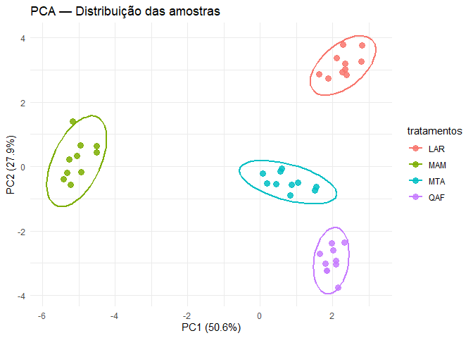<!-- -->

``` r


load_plot <- loadings %>%
  mutate(contrib = abs(PC1) + abs(PC2)) %>%
  arrange(desc(contrib)) %>%
  slice(1:8)

mul <- 2

load_plot <- load_plot %>%
  mutate(PC1 = PC1 * mul, PC2 = PC2 * mul)

ggplot(scores, aes(PC1, PC2, color = tratamentos)) +
  geom_point(size = 3, alpha = 0.85) +
  stat_ellipse(level = 0.95) +
  geom_segment(
    data = load_plot,
    aes(x = 0, y = 0, xend = PC1, yend = PC2),
    inherit.aes = FALSE,
    arrow = arrow(length = grid::unit(0.2, "cm"))
  ) +
  geom_text_repel(
    data = load_plot,
    aes(PC1, PC2, label = variavel),
    inherit.aes = FALSE,
    size = 3
  ) +
  theme_minimal() +
  labs(title = "Biplot PCA")
```

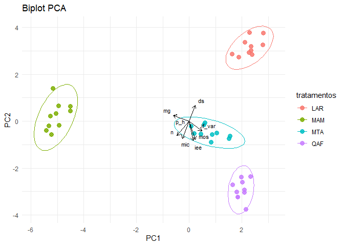<!-- -->

### Análise de Redundância

``` r

Y <- tmp %>%
  select(ds:mg)

X <- tmp %>%
  transmute(tratamentos = factor(tratamentos))

Ysc <- scale(Y)

rda_mod <- rda(Ysc ~ tratamentos, data = X)

summary(rda_mod)
#> 
#> Call:
#> rda(formula = Ysc ~ tratamentos, data = X) 
#> 
#> Partitioning of variance:
#>               Inertia Proportion
#> Total          18.000     1.0000
#> Constrained    14.704     0.8169
#> Unconstrained   3.296     0.1831
#> 
#> Eigenvalues, and their contribution to the variance 
#> 
#> Importance of components:
#>                        RDA1   RDA2    RDA3     PC1    PC2     PC3     PC4
#> Eigenvalue            8.999 4.8532 0.85175 0.96704 0.6642 0.38227 0.28149
#> Proportion Explained  0.500 0.2696 0.04732 0.05372 0.0369 0.02124 0.01564
#> Cumulative Proportion 0.500 0.7696 0.81690 0.87063 0.9075 0.92876 0.94440
#>                           PC5      PC6      PC7      PC8      PC9     PC10
#> Eigenvalue            0.26413 0.173998 0.164286 0.147945 0.084691 0.048715
#> Proportion Explained  0.01467 0.009667 0.009127 0.008219 0.004705 0.002706
#> Cumulative Proportion 0.95908 0.968744 0.977871 0.986090 0.990795 0.993502
#>                           PC11     PC12     PC13      PC14      PC15      PC16
#> Eigenvalue            0.037715 0.028469 0.021090 0.0150271 0.0061067 0.0037519
#> Proportion Explained  0.002095 0.001582 0.001172 0.0008348 0.0003393 0.0002084
#> Cumulative Proportion 0.995597 0.997178 0.998350 0.9991850 0.9995242 0.9997327
#>                            PC17      PC18
#> Eigenvalue            0.0033326 1.479e-03
#> Proportion Explained  0.0001851 8.219e-05
#> Cumulative Proportion 0.9999178 1.000e+00
#> 
#> Accumulated constrained eigenvalues
#> Importance of components:
#>                        RDA1   RDA2    RDA3
#> Eigenvalue            8.999 4.8532 0.85175
#> Proportion Explained  0.612 0.3301 0.05793
#> Cumulative Proportion 0.612 0.9421 1.00000
eigenvals(rda_mod)  
#>     RDA1     RDA2     RDA3      PC1      PC2      PC3      PC4      PC5 
#> 8.999271 4.853207 0.851745 0.967035 0.664235 0.382274 0.281494 0.264133 
#>      PC6      PC7      PC8      PC9     PC10     PC11     PC12     PC13 
#> 0.173998 0.164286 0.147945 0.084691 0.048715 0.037715 0.028469 0.021090 
#>     PC14     PC15     PC16     PC17     PC18 
#> 0.015027 0.006107 0.003752 0.003333 0.001479

prop <- eigenvals(rda_mod) / sum(eigenvals(rda_mod))
prop
#>      RDA1      RDA2      RDA3       PC1       PC2       PC3       PC4       PC5 
#> 0.4999595 0.2696226 0.0473192 0.0537242 0.0369019 0.0212375 0.0156385 0.0146741 
#>       PC6       PC7       PC8       PC9      PC10      PC11      PC12      PC13 
#> 0.0096666 0.0091270 0.0082192 0.0047050 0.0027064 0.0020953 0.0015816 0.0011717 
#>      PC14      PC15      PC16      PC17      PC18 
#> 0.0008348 0.0003393 0.0002084 0.0001851 0.0000822

anova(rda_mod, permutations = 999)
#> Permutation test for rda under reduced model
#> Permutation: free
#> Number of permutations: 999
#> 
#> Model: rda(formula = Ysc ~ tratamentos, data = X)
#>          Df Variance      F Pr(>F)    
#> Model     3  14.7042 53.538  0.001 ***
#> Residual 36   3.2958                  
#> ---
#> Signif. codes:  0 '***' 0.001 '**' 0.01 '*' 0.05 '.' 0.1 ' ' 1
anova(rda_mod, by = "axis", permutations = 999)
#> Permutation test for rda under reduced model
#> Forward tests for axes
#> Permutation: free
#> Number of permutations: 999
#> 
#> Model: rda(formula = Ysc ~ tratamentos, data = X)
#>          Df Variance       F Pr(>F)    
#> RDA1      1   8.9993 98.2997  0.001 ***
#> RDA2      1   4.8532 54.4845  0.001 ***
#> RDA3      1   0.8517  9.8205  0.001 ***
#> Residual 36   3.2958                   
#> ---
#> Signif. codes:  0 '***' 0.001 '**' 0.01 '*' 0.05 '.' 0.1 ' ' 1
anova(rda_mod, by = "terms", permutations = 999)
#> Permutation test for rda under reduced model
#> Terms added sequentially (first to last)
#> Permutation: free
#> Number of permutations: 999
#> 
#> Model: rda(formula = Ysc ~ tratamentos, data = X)
#>             Df Variance      F Pr(>F)    
#> tratamentos  3  14.7042 53.538  0.001 ***
#> Residual    36   3.2958                  
#> ---
#> Signif. codes:  0 '***' 0.001 '**' 0.01 '*' 0.05 '.' 0.1 ' ' 1

plot(rda_mod, type = "n", main = "RDA (Y ~ tratamentos) - dados padronizados")
points(rda_mod, display = "sites", pch = 19, col = as.numeric(X$tratamentos))
text(rda_mod, display = "bp", cex = 0.8)  
legend("topright", legend = levels(X$tratamentos),
       col = seq_along(levels(X$tratamentos)), pch = 19, bty = "n")
```

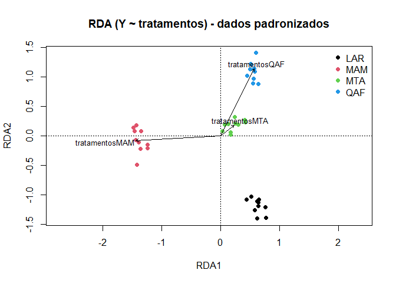<!-- -->

### PLS - Partial Least Squares (mínimos quadrados parciais

``` r
glimpse(data_set)
#> Rows: 40
#> Columns: 19
#> $ tratamentos <chr> "MTA", "MTA", "MTA", "MTA", "MTA", "MTA", "MTA", "MTA", "M…
#> $ ds          <dbl> 1.179139, 1.209172, 1.223709, 1.279122, 1.222785, 1.211284…
#> $ pt          <dbl> 0.4850923, 0.4719773, 0.4656292, 0.4414315, 0.4660326, 0.4…
#> $ mic         <dbl> 0.2553810, 0.2348952, 0.2427746, 0.2404692, 0.2433800, 0.2…
#> $ mac         <dbl> 0.22971136, 0.23708213, 0.22285460, 0.20096234, 0.22265261…
#> $ ksat        <dbl> 13.170000, 18.560000, 10.970000, 10.000000, 13.175000, 11.…
#> $ if_var      <dbl> 62.85714, 79.36508, 47.94521, 74.64789, 66.20383, 61.61321…
#> $ dmp         <dbl> 3.117068, 3.935556, 2.773950, 2.961878, 3.197113, 2.437374…
#> $ iee         <dbl> 8.564444, 9.031176, 8.579939, 8.512417, 8.671994, 8.704527…
#> $ n           <dbl> 0.1590000, 0.1710000, 0.1610000, 0.1580000, 0.1622500, 0.1…
#> $ s           <dbl> 0.05960000, 0.07550000, 0.06170000, 0.06380000, 0.06515000…
#> $ p_h         <dbl> 4.800000, 5.100000, 5.100000, 5.100000, 5.025000, 5.220398…
#> $ ctc         <dbl> 159.3300, 145.9300, 169.2400, 156.8400, 157.8350, 158.7280…
#> $ v_percent   <dbl> 0.6171468, 0.6573700, 0.6927440, 0.6812038, 0.6621161, 0.7…
#> $ mos         <dbl> 60.00000, 57.00000, 56.00000, 62.00000, 58.75000, 60.35167…
#> $ p           <dbl> 203.00000, 184.00000, 209.00000, 163.00000, 189.75000, 187…
#> $ k           <dbl> 0.8000000, 0.7000000, 0.8000000, 0.7000000, 0.7500000, 0.6…
#> $ ca          <dbl> 87.00000, 86.00000, 105.00000, 96.00000, 93.50000, 103.023…
#> $ mg          <dbl> 10.530000, 9.230000, 11.440000, 10.140000, 10.335000, 10.6…
```

``` r

tmp <- data_set %>%
  dplyr::select(tratamentos, where(is.numeric)) %>%
  tidyr::drop_na()

X <- tmp %>% dplyr::select(-tratamentos) %>% as.matrix()
Xsc <- scale(X)

# PLS

Y_class <- tmp %>% pull(tratamentos) %>% factor()

Y_dummy <- model.matrix(~ Y_class - 1)

set.seed(123)
plsda_mod <- plsr(Y_dummy ~ Xsc, ncomp = 10, validation = "CV")

summary(plsda_mod)
#> Data:    X dimension: 40 18 
#>  Y dimension: 40 4
#> Fit method: kernelpls
#> Number of components considered: 10
#> 
#> VALIDATION: RMSEP
#> Cross-validated using 10 random segments.
#> 
#> Response: Y_classLAR 
#>        (Intercept)  1 comps  2 comps  3 comps  4 comps  5 comps  6 comps
#> CV          0.4441   0.4052   0.1568   0.1210  0.09714  0.08624  0.08283
#> adjCV       0.4441   0.4054   0.1564   0.1201  0.09531  0.08374  0.08070
#>        7 comps  8 comps  9 comps  10 comps
#> CV     0.08165  0.07317  0.06913   0.05446
#> adjCV  0.08103  0.07008  0.06663   0.05161
#> 
#> Response: Y_classMAM 
#>        (Intercept)  1 comps  2 comps  3 comps  4 comps  5 comps  6 comps
#> CV          0.4441  0.10105  0.09572  0.05786  0.05670  0.05640  0.05655
#> adjCV       0.4441  0.09464  0.09540  0.05705  0.05579  0.05572  0.05568
#>        7 comps  8 comps  9 comps  10 comps
#> CV     0.05413  0.04813  0.04715   0.04351
#> adjCV  0.05421  0.04626  0.04599   0.04301
#> 
#> Response: Y_classMTA 
#>        (Intercept)  1 comps  2 comps  3 comps  4 comps  5 comps  6 comps
#> CV          0.4441   0.4377   0.4381   0.2503   0.2220   0.2134   0.2072
#> adjCV       0.4441   0.4372   0.4375   0.2476   0.2191   0.2102   0.2017
#>        7 comps  8 comps  9 comps  10 comps
#> CV      0.1954   0.1822   0.1829    0.1815
#> adjCV   0.1893   0.1775   0.1779    0.1744
#> 
#> Response: Y_classQAF 
#>        (Intercept)  1 comps  2 comps  3 comps  4 comps  5 comps  6 comps
#> CV          0.4441   0.4134   0.2317   0.1444   0.1444   0.1442   0.1446
#> adjCV       0.4441   0.4138   0.2312   0.1430   0.1437   0.1432   0.1428
#>        7 comps  8 comps  9 comps  10 comps
#> CV      0.1390   0.1247   0.1238    0.1343
#> adjCV   0.1351   0.1237   0.1213    0.1313
#> 
#> TRAINING: % variance explained
#>             1 comps  2 comps  3 comps  4 comps  5 comps  6 comps  7 comps
#> X            50.641   78.498    85.02    87.81    91.28    93.89    95.10
#> Y_classLAR   19.318   88.222    94.00    97.25    98.40    98.50    98.50
#> Y_classMAM   95.278   95.602    98.79    99.05    99.07    99.16    99.16
#> Y_classMTA    2.322    3.816    76.60    86.45    90.11    92.96    94.48
#> Y_classQAF   14.762   73.255    92.12    92.79    93.74    94.90    96.33
#>             8 comps  9 comps  10 comps
#> X             96.08    97.11     97.49
#> Y_classLAR    99.20    99.39     99.60
#> Y_classMAM    99.47    99.50     99.52
#> Y_classMTA    94.94    95.21     96.05
#> Y_classQAF    96.49    97.10     97.19
plot(RMSEP(plsda_mod))
```

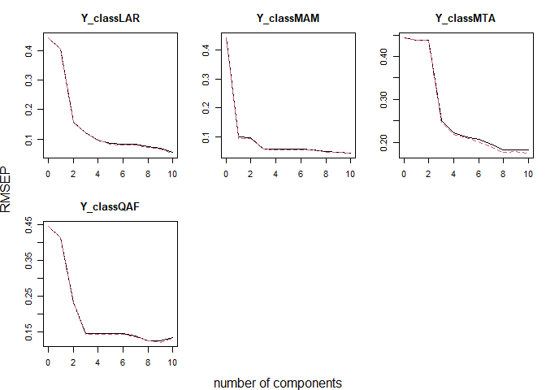<!-- -->

``` r

ncomp_use <- 2

pred <- predict(plsda_mod, ncomp = ncomp_use)
pred_mat <- pred[, , 1]

pred_class <- colnames(pred_mat)[max.col(pred_mat)]
pred_class <- gsub("^Y_class", "", pred_class)

table(Real = Y_class, Previsto = pred_class)
#>      Previsto
#> Real  LAR MAM QAF
#>   LAR  10   0   0
#>   MAM   0  10   0
#>   MTA   0   0  10
#>   QAF   0   0  10

# PLS REGRESSÃO

if ("if_var" %in% names(tmp) && is.numeric(tmp$if_var)) {

  Y_cont <- tmp$if_var

  set.seed(123)
  plsr_mod <- plsr(Y_cont ~ Xsc, ncomp = 10, validation = "CV")

  summary(plsr_mod)

  plot(RMSEP(plsr_mod))
  plot(R2(plsr_mod))

  coef(plsr_mod, ncomp = 2)
}
#> Data:    X dimension: 40 18 
#>  Y dimension: 40 1
#> Fit method: kernelpls
#> Number of components considered: 10
#> 
#> VALIDATION: RMSEP
#> Cross-validated using 10 random segments.
#>        (Intercept)  1 comps  2 comps  3 comps  4 comps  5 comps  6 comps
#> CV           14.94    8.025    6.772    5.146    2.754    1.715    1.082
#> adjCV        14.94    8.006    6.764    5.087    2.667    1.681    1.017
#>        7 comps  8 comps  9 comps  10 comps
#> CV      0.8262   0.5697   0.3423    0.2479
#> adjCV   0.7834   0.5474   0.3228    0.2298
#> 
#> TRAINING: % variance explained
#>         1 comps  2 comps  3 comps  4 comps  5 comps  6 comps  7 comps  8 comps
#> X         48.00    76.14    84.24    86.96    91.62    92.90    94.49    96.24
#> Y_cont    72.77    82.19    92.25    98.42    99.34    99.84    99.93    99.97
#>         9 comps  10 comps
#> X         97.00     97.76
#> Y_cont    99.99    100.00
```

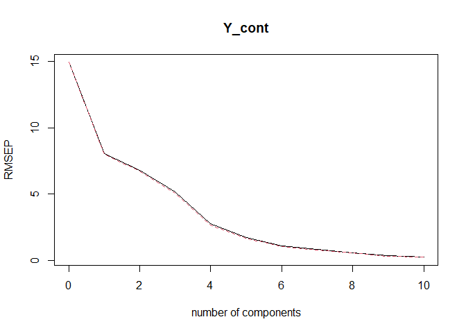<!-- -->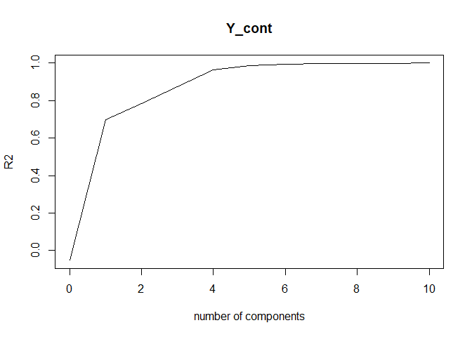<!-- -->

    #> , , 2 comps
    #> 
    #>               Y_cont
    #> ds        -0.5666855
    #> pt         0.2764723
    #> mic        1.0096500
    #> mac       -1.2230830
    #> ksat      -0.5750754
    #> if_var     3.1118705
    #> dmp        1.5776237
    #> iee        1.9340009
    #> n          0.5491260
    #> s          1.4974721
    #> p_h       -1.1818351
    #> ctc       -0.8084813
    #> v_percent -0.8606531
    #> mos        1.5446988
    #> p         -1.0557307
    #> k         -0.8606279
    #> ca        -0.8133140
    #> mg        -0.9035608

# gráfico

``` r
scores_pls <- scores(plsda_mod, ncomp = ncomp_use)

plot(scores_pls[,1], scores_pls[,2],
     pch = 19,
     col = as.numeric(Y_class),
     xlab = "PLS comp 1",
     ylab = "PLS comp 2",
     main = "PLS-DA — Scores dos indivíduos")

legend("bottom",
       legend = levels(Y_class),
       col = seq_along(levels(Y_class)),
       pch = 19,
       horiz = TRUE,
       inset = -0.25,
       xpd = TRUE,
       bty = "n")

abline(h = pretty(scores_pls[,2]), col = "gray90")
abline(v = pretty(scores_pls[,1]), col = "gray90")
```

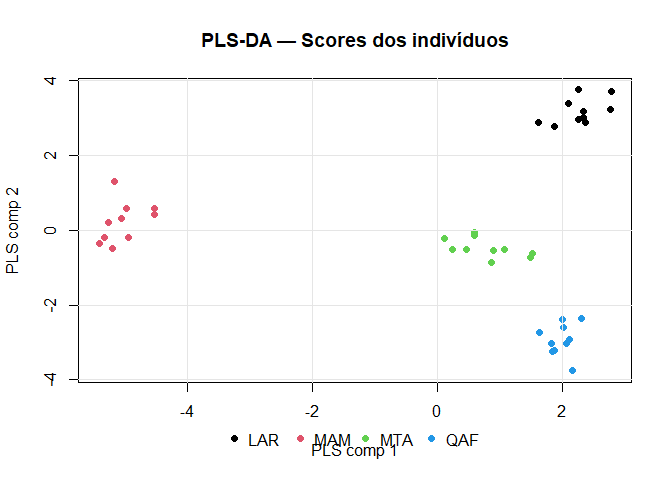<!-- -->
